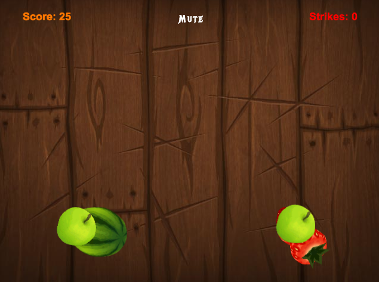

# FruitLoonie
[Live][live]



### Instructions
1. Clone file and run $ 'npm -i --S'
2. Run server with $ 'webpack-dev--server'
3. Proceed to 'localhost:8080' on browser, preferably chome.

### Background
FruitLoonie is an interactive slashing game inspired by Fruit Ninja with one simple objective, slashing as many fruits as possible without having slip pass or slashing a bomb. This game utilize ES6, babel.js, Create.Js, and canvas.

### Projectiles
Shapes follow parabolic projectile motion and is randomized by starting location. Randomness is added with modulus of shape id

``` JavaScript
moveSliceables() {
  let self = this;
  let stagedCirclesIds = this.stagedCirclesIds();
  if (stagedCirclesIds.length > 0) {
    stagedCirclesIds.forEach( id => {
      let deltaX = self.projectileMotionX(self.circles[id].x, id);
      let deltaY = self.projectileMotionY(self.circles[id].x, id);

      self.circles[id].x += deltaX;
      self.circles[id].model.x += deltaX;
      self.circles[id].y += deltaY;
      self.circles[id].model.y += deltaY;

      // self.handleSliceables(self.circles[id], time)
      self.stage.update();
    });
  }
  this.stage.update();
}

projectileMotionX(x, id) {
  return 2 * this.velocity + (id % 3);
}

projectileMotionY(x, id) {
  if (x <= 320) {
    return -.26333333*Math.pow(x,2)/100000 - 2 - id % 2;
    // - 3 + Math.random()*1;
  } else {
    return .2633333*Math.pow(x,2)/100000 + 2 + id % 2;
    // + 3 + Math.random()*1;
  }
}
```

### Out of Bounds & Strikes
Out of bounds is checked by if object exceeds half point from starting location and exceeding boundary length of canvas. Shape is removed upon truthy value. Strike is added, after 3 strikes, game is over.

```JS
checkOutOfBounds(id) {
  let self = this;
  let strikes = 0;
  this.stagedCirclesIds().forEach( id => {
    // if greater than midpoint of canvas check if greater than width and height of canvas, doesn't check already out of bounds shapes
    if ((self.circles[id].outOfBounds === false) && (self.circles[id].x > self.width / 2) && (self.circles[id].y > self.height || self.circles[id].x > self.width)) {
      self.circles[id].outOfBounds = true;
      strikes += 1;
      self.stage.removeChild(self.circles[id])
      self.stage.removeChild(self.circles[id].model);
      self.stage.update();
      // this.circles[id].mouseEnabled = false;
    }
    self.stage.update();
  })
  return strikes;
}
```


### Collision & Scores
Collisions increase score and removes child from stage.

```JS
checkCollisions() {
  let pt;
  let self = this;
  let score = 0;
  this.stagedCirclesIds().forEach( id => {
    pt = this.circles[id].globalToLocal(this.stage.mouseX, this.stage.mouseY);
// this.circles[id] && this.stage.mouseInBounds &&
    if (this.circles[id].hitTest(pt.x, pt.y) && this.circles) {
      this.playSound("splatter")
      score += 1;
      this.circles[id].mouseEnabled = false;
      this.stage.removeChild(this.circles[id].model);
      this.stage.removeChild(this.circles[id]);
      this.stage.update();
    }
  });
  return score
}
```

[live]: https://alexliang.co/FruitLoonie
